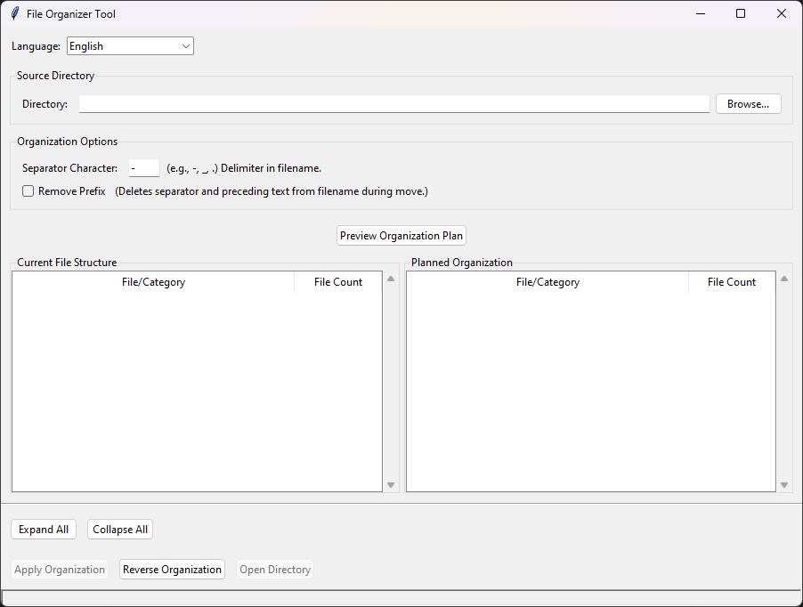

# File Organizer Tool

A tool to organize files into subdirectories based on a prefix in their filenames. Supports multiple languages, themes, and both GUI and command-line interfaces.

## Screenshot



*The File Organizer Tool interface showing the main window with file organization options and preview panes.*

## Features

-   Organize files into subdirectories based on a user-defined separator and prefix.
-   Option to remove the prefix from filenames upon organization.
-   Side-by-side preview of current file structure and planned organization (in GUI mode).
-   Undo (Reverse) organization: Moves files back from subdirectories to the parent directory.
-   Multilingual interface (English, Turkish, German, Spanish, French, Italian, Portuguese, Japanese, Chinese, Russian supported out-of-the-box).
-   Theme selection for UI customization.
-   "Open Directory" button to quickly access the organized folder.
-   Cross-platform support (Windows, macOS, Linux).
-   Command-line interface for automation and scripting.

## Requirements

-   Python 3.x
-   Tkinter (usually included with Python standard library) - only needed for GUI mode

## Installation

1.  Clone this repository or download the source code.
    ```bash
    git clone https://github.com/MC-Oruc/file-organizer-tool.git
    cd file-organizer-tool
    ```
2.  No external Python packages are strictly required if using a standard Python installation that includes Tkinter. If you encounter issues, ensure Tk/Tcl is properly installed for your Python version.

3.  Optional: Install as a Python package
    ```bash
    pip install .
    ```

## Usage

### Graphical User Interface (GUI)

1.  Run the `main.py` script without arguments:
    ```bash
    python main.py
    ```
    Or if installed as a package:
    ```bash
    file-organizer
    ```

2.  **Select Directory**: Click "Browse..." (or its localized equivalent) to choose the directory containing files you want to organize. The "Current File Structure" pane will populate.
3.  **Set Options**:
    *   **Separator Character**: Define the character in filenames that precedes the part you want to use as the subdirectory name (default is `-`).
    *   **Remove Prefix**: Check this box if you want to remove the prefix and the separator from the filenames when they are moved.
4.  **Preview**: Click "Preview Organization Plan". The "Planned Organization" pane will show how files will be categorized and (optionally) renamed.
5.  **Apply**: If the plan looks correct, click "Apply Organization".
6.  **Reverse**: To undo the last organization in the selected directory, click "Reverse Organization". This will move files from the created subdirectories back to the parent directory and attempt to restore original filenames if "Remove Prefix" was used.
7.  **Language & Theme**: Use the dropdown menus at the top to change the UI language or theme.

### Command Line Interface (CLI)

For scripting and automation, use the command-line interface:

```bash
python main.py [DIRECTORY] [OPTIONS]
```

Or if installed as a package:

```bash
file-organizer [DIRECTORY] [OPTIONS]
```

#### Basic Usage Examples

Organize files with default settings (uses '-' as separator):
```bash
file-organizer /path/to/directory
```

Specify a different separator:
```bash
file-organizer /path/to/directory -s "_"
```

Remove prefixes from filenames:
```bash
file-organizer /path/to/directory -r
```

Reverse a previous organization:
```bash
file-organizer /path/to/directory --reverse
```

#### Command Line Options

```
positional arguments:
  directory             Directory containing files to organize (if not specified, GUI mode is launched)

optional arguments:
  -h, --help            Show this help message and exit
  -s SEPARATOR, --separator SEPARATOR
                        Character that separates prefix from filename (default: -)
  -r, --remove-prefix   Remove the prefix from filenames when organizing
  -v, --verbose         Show detailed information about the operations
  -y, --yes             Skip confirmation prompts
  --reverse             Reverse a previous organization, moving files back from subdirectories
```

## Adding New Languages

1.  Go to the `locales/` directory.
2.  Copy an existing `.json` file (e.g., `en.json`) and rename it to `[lang_code].json` (e.g., `ko.json` for Korean). Use standard ISO 639-1 language codes.
3.  Open the new JSON file and translate all string values into the target language.
    *   Pay special attention to the `_lang_name_` key; it should be the native name of the language (e.g., "한국어" for Korean).
4.  Save the file. The application will automatically detect and list the new language in the dropdown menu upon next launch.

## Contributing

Contributions are welcome! Please feel free to submit a Pull Request or open an Issue.
When contributing, please ensure:
- Code is well-commented.
- New UI strings are added to all locale files.
- Changes are tested.

## License

This project is licensed under the MIT License - see the [LICENSE](LICENSE) file for details.
